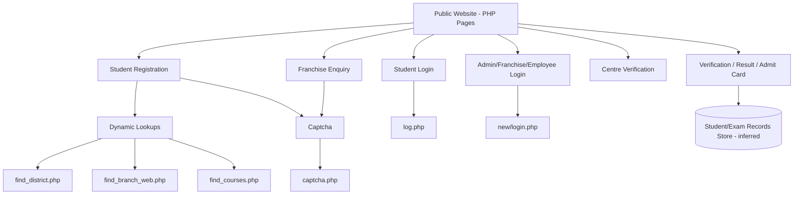

# Gokul Shree School Website Workflow and Architecture

## Scope and Sources
This document is based on a local HTTrack mirror of `https://www.gokulshreeschool.com/` and the provided screenshots.
Mirror path: `c:\Users\mevis\-GM-\_site_mirror`
Mirror date: February 5, 2026

Anything not visible in the mirrored HTML is marked as inferred or unknown.

## Site Map (Observed Navigation)
- Student: Registration Process, Examination Process, Placement
- About Us: Profile, Chairman Message, Vision & Mission
- Courses: Diploma, Vocational, Yoga, University
- Student Zone: Registration, Verification, Login, Admit Card, Result
- Franchise: Get Franchise, Apply Franchise
- Gallery: Photos, Videos
- Login: Admin, Franchise, Employee, Student, Webmail
- Contact: Contact Us, Find Branch
- Downloads
- Payment (Make Payment)

## Public Workflows (Observed)

### Online Registration
Entry: `registration.php` (mirrored as `registration.html`)

Inputs:
- State (select)
- District (select)
- Study Centre (select)
- Religion (select)
- Course Category (select)
- Course Name (select)
- Session (select)
- Full Name (text)
- Father's Name (text)
- Mother's Name (text)
- Date of Birth (date)
- Gender (select)
- Category (select)
- Marital Status (select)
- Identity Type (select)
- ID Number (text, max length 12)
- Last General Qualification (select)
- Contact Number (text, max length 10)
- Email (text)
- Address (textarea)
- Pincode (text, max length 6)
- Enquiry Source (select)
- Verification Code (text, required)

Actions:
- Register Me

Observed behaviors:
- Dependent dropdowns call dynamic endpoints: `find_district.php?cid=`, `find_branch_web.php?cid=`, `find_courses.php?cid=`.
- Captcha is provided by `captcha.php`.
- Hidden fields exist for internal identifiers: `refer`, `username`, `uid`, `branch`, `pid`, `cid`.

Notes:
- Session list in HTML shows 2009-2010 through 2021-2022, while your screenshot shows 2022-2023. This likely changes server-side or is updated in production.

### Student Login
Entry: `login.php` (mirrored as `login.html`)

Inputs:
- Registration No (text)
- Password (password)

Action:
- Login (POSTs to `log.php`)

Note:
- Page indicates "Password Recover By The Institute".

### Student Verification
Entry: `verification.php` (mirrored as `verification.html`)

Inputs:
- Registration No (text)

Action:
- Verify

Observed output:
- "No record Found" state exists.

### Result Verification
Entry: `result.php` (mirrored as `result.html`)

Inputs:
- Registration No (text)

Actions:
- Verify
- Cancel

Observed output:
- "NO RECORD FOUND" state exists.

### Marksheet Verification
Entry: `marksheet-verification.php` (mirrored as `marksheet-verification.html`)

Inputs:
- Registration No (text)

Actions:
- Verify
- Cancel

### Certificate Verification
Entry: `certificate-verification.php` (mirrored as `certificate-verification.html`)

Inputs:
- Registration No (text)

Actions:
- Verify
- Cancel

### Download Admit Card
Entry: `download-admitcard.php` (mirrored as `download-admitcard.html`)

Inputs:
- Registration No (text)

Actions:
- Verify
- Cancel

Observed output:
- "NO RECORD FOUND" state exists.

### Centre Verification
Entry: `centre-verification.php` (mirrored as `centre-verification.html`)

Inputs:
- Search Code (text, `bcode`)

Actions:
- Verify
- Cancel

Observed output:
- "Record Not Found" state exists.

### Franchise Enquiry (Apply Franchise)
Entry: `franchise-enquiry.php` (mirrored as `franchise-enquiry.html`)

Inputs:
- First Name (required)
- Last Name
- Phone No
- Mobile Number (required, max length 10)
- Email (required)
- Gender (required)
- Organization Details (required)
- Address Village/Area/Location (required)
- Address Block
- State (select)
- District (select)
- Pincode (max length 6)
- Verification Code (required)

Actions:
- Register Me

Observed behaviors:
- Captcha is provided by `captcha.php`.
- State and District fields are populated in-page (no AJAX found here).

## Admin/Franchise/Employee Login (Observed)
Entry: `/new/` (mirrored as `new/index.html`)

Inputs:
- Username (`loginid`)
- Password

Action:
- Login (POSTs to `/new/login.php`)

Note:
- This appears to be a shared login for Admin, Franchise, and Employee roles.
- "Forgot Password?" points to `/new/forgot.php`.

## Architecture (Observed + Inferred)

Observed:
- Server-rendered PHP site with form submissions to PHP endpoints.
- Public workflows are form-driven (registration, verification, login, results).
- Captcha integration via `captcha.php`.
- Dynamic dropdown population for registration uses AJAX endpoints (`find_district.php`, `find_branch_web.php`, `find_courses.php`).

Inferred:
- Central database storing students, courses, centres, verification records, and exam/admit card data.
- Admin back office likely manages centres, courses, student records, results, and documents.

### High-Level Flow (Conceptual)
1. Public user submits registration form.
2. Backend validates and stores student data.
3. Admin/back-office manages enrolment and exams.
4. Verification, admit card, and result checks read from stored records.

### Architecture Diagram (Conceptual)

## Open Questions (Remaining)
- Admin/Franchise/Employee dashboards and their modules after login.
- Output format for successful Admit Card, Result, and Verification (PDF vs HTML view).
- Payment provider details (payment page only references a missing image/file in the mirror).

## Next Steps
If you want this document completed end-to-end, provide:
- Admin panel screenshots or HTML export after login.
- One successful Result or Admit Card output (PDF or HTML).
- Payment gateway details (provider name or redirect domain).

**Last Updated:** February 5, 2026
